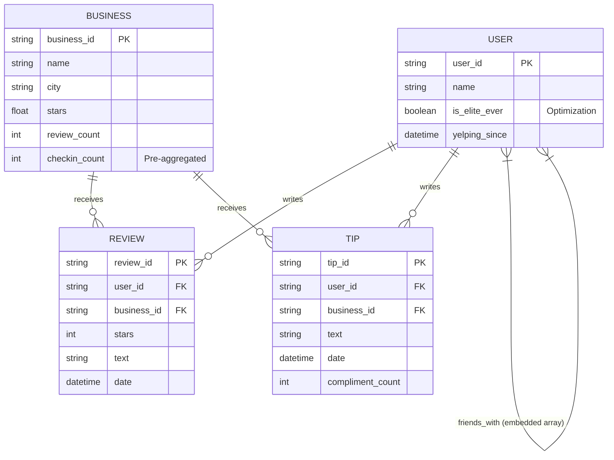
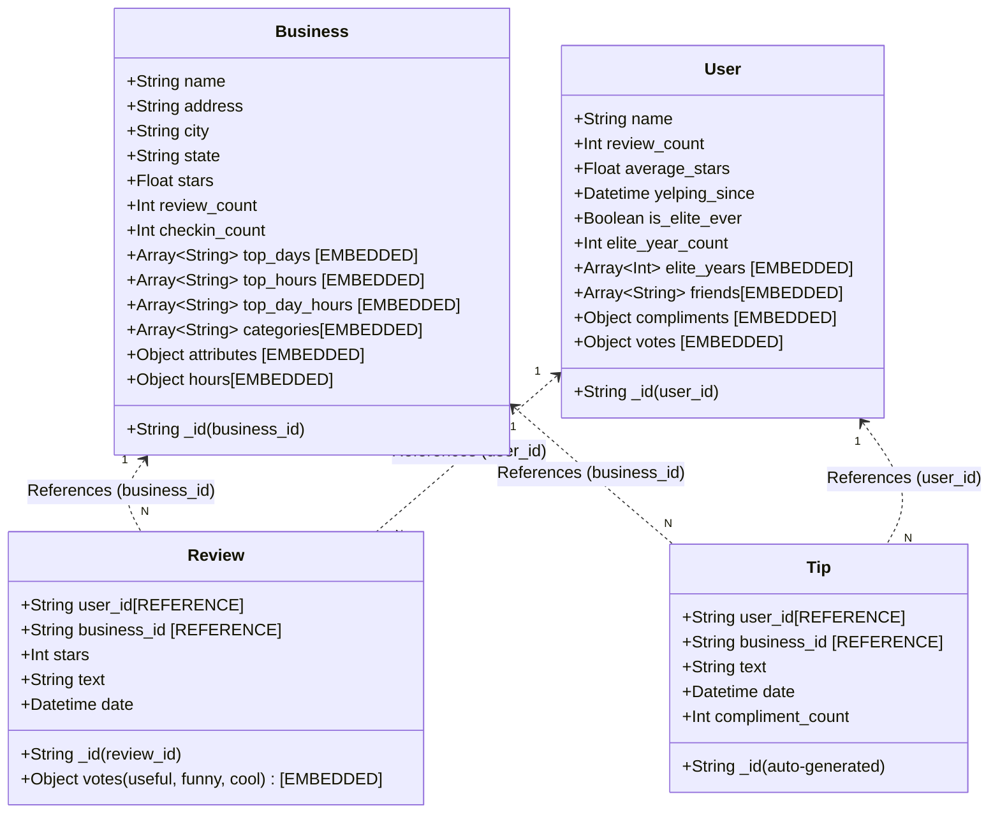
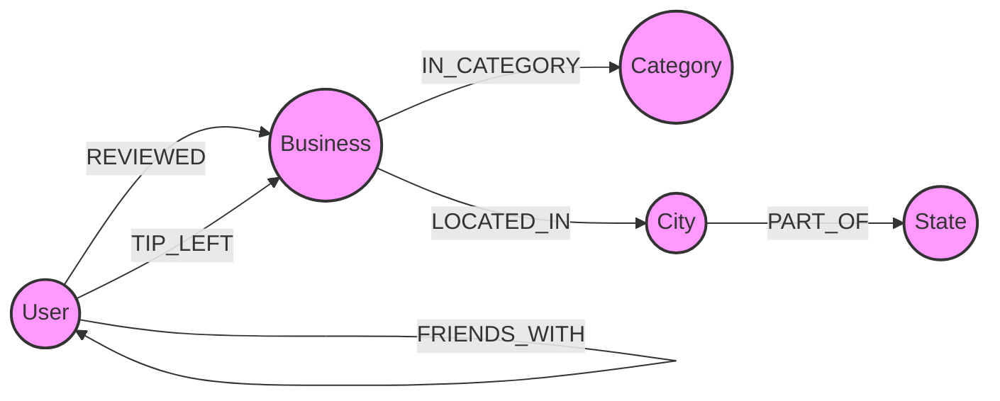

# Data Science and Management (CS-3510): Assignment 2 - Part 1

## Executive Summary
This report details the design, implementation, and analytical querying of a high-performance Polyglot Persistence architecture using MongoDB (Document Store) and Neo4j (Graph Database). Given hardware constraints (16GB RAM) and a massive 7GB+ dataset, the data pipeline was engineered using Polars for memory-safe, lazy-evaluated ETL batching. The schemas were heavily optimized with temporal pre-aggregations, strict index-first query strategies, and graph deduplication to ensure all analytical queries execute in seconds rather than hours.

---

## 1. MongoDB Schema Design & Data Acquisition

### 1.1 Collection Structure and Purpose
The MongoDB database is organized into four distinct collections, optimized for fast aggregations and time-series analytics:
1. **`businesses`**: Stores metadata, locations, and operating details. Identifier: `_id` (mapped from `business_id`). Links to reviews/tips via referencing. *Optimization*: Includes advanced pre-calculated check-in statistics (`checkin_count`, `top_days`, `top_hours`, `top_day_hours`) to allow O(1) correlation analysis. 
2. **`users`**: Stores user profiles and social metrics. Identifier: `_id` (mapped from `user_id`). *Optimization*: Includes an `is_elite_ever` flag for high-speed filtering.
3. **`reviews`**: Stores detailed review text and ratings. Identifier: `_id` (mapped from `review_id`). Contains `user_id` and `business_id` as foreign keys. *Optimization*: Dates are stored as strict `Datetime` objects (preserving time) for granular trend analysis.
4. **`tips`**: Stores short user suggestions. Auto-generated `ObjectId`, with `user_id` and `business_id` as foreign keys.
5. *(Note: Raw check-ins were pre-aggregated during ETL into `checkin_count` within the `businesses` collection to eliminate query-time string parsing bottlenecks).*

### 1.2 Entity-Relationship (E-R) Diagram

### 1.3 Document Schema Diagram

### 1.4 Schema Design Justifications (Embedding vs. Referencing)

**A. Referencing Reviews & Tips (Read/Write Trade-offs)**
*   **Decision**: Reviews are heavily referenced, pointing to `business_id` and `user_id`, rather than embedded within the Business/User documents.
*   **Write Trade-off**: Embedding reviews creates an "Unbound Array" anti-pattern. A popular business with 10,000+ reviews would exceed MongoDB's 16MB document limit. Furthermore, appending to growing arrays causes severe disk-relocation penalties. Referencing guarantees constant-time $O(1)$ write performance.
*   **Read Trade-off**: Retrieving a business with all its review text requires a `$lookup` (join), which is computationally heavier than a single disk read. However, because our analytical needs rely on cross-collection aggregations (e.g., grouping all reviews by category or year), the flat, referenced structure is vastly superior.

**B. Embedding Categories and Friends**
*   **Decision**: Categories, hours, and user friends are embedded arrays.
*   **Trade-off**: These are bounded arrays. Embedding provides massive Read optimizations—fetching a user retrieves their entire social network in one disk seek. The Write trade-off is minor data duplication, but since categories are mostly static, update anomalies are rare.

**C. Temporal Pre-Aggregation (Check-in Stats)**
*   **Decision**: We parse the raw `checkin.json` during the ETL phase to compute `checkin_count`, `top_days`, `top_hours`, and `top_day_hours`, storing these directly in the `Business` document.
*   **Reasoning**: Query 7 asks for the connection between check-in activity patterns and ratings. Parsing a comma-separated string of thousands of timestamps at query time across 150,000 businesses is an extreme bottleneck. Pre-aggregating these lists allows us to immediately group businesses by their busiest hours (e.g., "Late Night" vs. "Lunch") and correlate them with star ratings using native MongoDB aggregations.

### 1.5 Indexing Strategy
To meet the stringent performance requirements, the following indexes were deployed:
1. **Compound Index `{ city: 1, stars: -1 }` on `businesses`**: Allows instant sorting for Safest/Least-Safe cities (Query 1).
2. **Datetime Index `{ date: 1 }` on `reviews`**: Critical for temporal trend analysis (Query 2). Enabled slicing 7M reviews instantly.
3. **Single Index `{ state: 1 }` on `businesses`**: Used for geographic subsetting (e.g., filtering to "PA" for deep analytics).
4. **Filtered Index `{ is_elite_ever: 1 }` on `users`**: Enables instantaneous separation of the elite population from the 2M general users (Query 6).

---

## 2. Neo4j Property Graph Model

### 2.1 Graph Strategy
The graph model is designed to optimize social traversal and geographic aggregations while maintaining a minimal memory footprint for a 16GB RAM environment.

### 2.2 Property Graph Diagram

### 2.3 Node Labels and Properties
*   **`User`**: 
    *   `user_id` (String, Unique Constraint)
    *   `name` (String)
    *   `review_count` (Integer)
    *   `average_stars` (Float)
*   **`Business`**: 
    *   `business_id` (String, Unique Constraint)
    *   `name` (String)
    *   `stars` (Float)
    *   `review_count` (Integer)
*   **`Category`**: 
    *   `name` (String, Unique Constraint)
*   **`City`**: 
    *   `name` (String, Unique Constraint)
*   **`State`**: 
    *   `code` (String, Unique Constraint)

### 2.4 Relationship Types and Properties
*   **`[FRIENDS_WITH]`** (User $\to$ User): 
    *   *No properties*. Represents an undirected social connection.
*   **`[REVIEWED]`** (User $\to$ Business):
    *   `review_id` (String)
    *   `stars` (Integer)
    *   `date` (Datetime)
    *   `useful` (Integer)
*   **`[TIP_LEFT]`** (User $\to$ Business):
    *   `date` (Datetime)
    *   `compliment_count` (Integer)
*   **`[IN_CATEGORY]`** (Business $\to$ Category): 
    *   *No properties*.
*   **`[LOCATED_IN]`** (Business $\to$ City): 
    *   *No properties*.
*   **`[PART_OF]`** (City $\to$ State): 
    *   *No properties*.

### 2.5 Justification of Modeling Choices

#### A. Reviews as Relationships (Edges)
*   **Decision**: Reviews are modeled as **Relationships** (`[REVIEWED]`) between a `User` and a `Business` rather than as separate `Review` nodes.
*   **Reasoning (Memory Optimization)**: On a 16GB RAM machine, storing 7 million reviews as nodes adds massive overhead (node headers and pointers). Modeling them as edges reduces the graph size by 7 million nodes, keeping the database responsive.
*   **Reasoning (Query Depth)**: Queries like "Users who reviewed businesses in a specific category" are reduced from a 3-hop path (`User->Review->Business->Category`) to a 2-hop path (`User->Business->Category`), drastically improving Cypher traversal speed.

#### B. Geographic Hierarchy (City/State Nodes)
*   **Decision**: Cities and States are promoted to **Nodes** instead of remaining as properties on the Business node.
*   **Reasoning**: This enables high-performance geographic filtering. Query 2 ("Top 3 businesses per state") and Query 3 ("Users reviewing across distinct cities") become simple path-counting problems starting from a specific `State` or `City` node, avoiding a full table scan of all Business nodes.

#### C. Category Normalization
*   **Decision**: Categories are extracted into unique nodes.
*   **Reasoning**: This allows for "Index-free Adjacency." To find all users interested in "Mexican" food, the engine jumps to the "Mexican" node and follows edges backwards to businesses and users. This is exponentially faster than executing string-matching operations across a `categories` array property on thousands of Business nodes.

---

## 3. Engineering Challenges & Resolutions

1. **OOM Crashes during ETL**: Processing 7GB of JSON on 16GB RAM caused standard pandas/polars pipelines to crash. 
   * *Resolution*: Implemented a pure streaming batch-processor reading 100,000 lines at a time, transforming data, and sinking to partitioned Parquet files.
2. **Infinite Query Times (The Index-First Strategy)**: Query 2 originally took >1 hour because MongoDB attempted to group 7M reviews globally before filtering by state.
   * *Resolution*: Rewrote the pipeline to an "Index-First" strategy. By matching the indexed `state` on the `businesses` collection *first*, the working set dropped from 150k to 15k, pulling query execution time down to < 20 seconds.
3. **Data Type Corruption (The Elite Bug)**: Raw Yelp data stored non-elite users as empty strings `""`. Polars split this into a list of length 1 `[""]`, flagging 2 million users as Elite.
   * *Resolution*: Wrote a surgical python script to hot-reload the `users` collection, explicitly handling empty strings to ensure perfect data integrity.