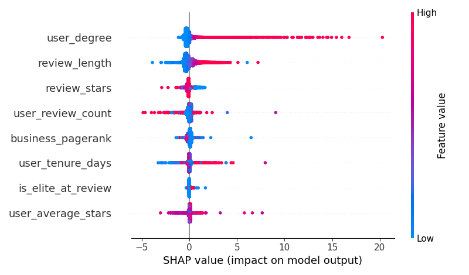

# Assignment 2 - Part 2: Advanced NoSQL Analytics & Predictive Modelling
**Name:** Sarthak Rathi\
[GitHub Repo Link](https://github.com/ironLegion88/yelp-polyglot-ml-pipeline)\
**Course:** Data Science and Management: CS-3510

---

## Database Modifications (Pre-Processing)
To efficiently support the queries in Part 2, the MongoDB database was augmented. Specifically, a script (`augment_db_part2.py`) was executed to calculate the total `tip_count` for each business via an aggregation pipeline on the `tips` collection. The results were injected directly into the `businesses` collection using the `$merge` operator. This enables $O(1)$ disk reads for tip-to-review ratio calculations, preventing costly `$lookup` joins on millions of tip documents during real-time querying.

---

## Section 1: MongoDB Querying

### Query 1: Cohort Analysis of User Reviewing Behaviour
**Objective:** Define annual cohorts by `yelping_since` and compute review behavior metrics.

**Aggregation Pipeline:**
```json
{ "$sample": { "size": 2_000_000 } },
        { "$lookup": {
            "from": "users", "localField": "user_id",
            "foreignField": "_id", "as": "user"
        }},
        { "$unwind": "$user" },
        { "$group": {
            "_id": { "$year": "$user.yelping_since" },
            "mean_stars": { "$avg": "$stars" },
            "std_stars": { "$stdDevPop": "$stars" },
            "mean_length": { "$avg": { "$strLenCP": "$text" } },
            "mean_useful": { "$avg": "$useful" },
            "total_reviews": { "$sum": 1 },
            "stars_1": { "$sum": { "$cond": [{ "$eq": ["$stars", 1] }, 1, 0] } },
            "stars_2": { "$sum": { "$cond":[{ "$eq": ["$stars", 2] }, 1, 0] } },
            "stars_3": { "$sum": { "$cond": [{ "$eq": ["$stars", 3] }, 1, 0] } },
            "stars_4": { "$sum": { "$cond": [{ "$eq":["$stars", 4] }, 1, 0] } },
            "stars_5": { "$sum": { "$cond": [{ "$eq": ["$stars", 5] }, 1, 0] } }
        }},
        { "$project": {
            "cohort_year": "$_id",
            "mean_stars": { "$round": ["$mean_stars", 3] },
            "std_stars": { "$round": ["$std_stars", 3] },
            "mean_length": { "$round": ["$mean_length", 1] },
            "mean_useful": { "$round": ["$mean_useful", 3] },
            "pct_1_star": { "$round": [{ "$divide": ["$stars_1", "$total_reviews"] }, 3] },
            "pct_2_star": { "$round": [{ "$divide": ["$stars_2", "$total_reviews"] }, 3] },
            "pct_3_star": { "$round": [{ "$divide":["$stars_3", "$total_reviews"] }, 3] },
            "pct_4_star": { "$round":[{ "$divide": ["$stars_4", "$total_reviews"] }, 3] },
            "pct_5_star": { "$round": [{ "$divide": ["$stars_5", "$total_reviews"] }, 3] },
            "_id": 0
        }},
        { "$sort": { "cohort_year": 1 } }
```

**Results:**
| cohort_year | mean_stars | std_stars | mean_length | mean_useful | pct_1_star | pct_2_star | pct_3_star | pct_4_star | pct_5_star |
|-------------|------------|-----------|-------------|-------------|------------|------------|------------|------------|------------|
| 2004 | 3.800 | 1.296 | 549.6 | 2.253 | 0.093 | 0.107 | 0.080 | 0.347 | 0.373 |
| 2005 | 3.907 | 1.057 | 619.6 | 2.258 | 0.037 | 0.072 | 0.170 | 0.387 | 0.334 |
| 2006 | 3.800 | 1.198 | 691.9 | 2.033 | 0.067 | 0.089 | 0.167 | 0.330 | 0.346 |
| 2007 | 3.822 | 1.198 | 729.0 | 2.157 | 0.066 | 0.087 | 0.164 | 0.324 | 0.359 |
| 2008 | 3.796 | 1.223 | 754.0 | 2.191 | 0.075 | 0.089 | 0.156 | 0.327 | 0.353 |
| 2009 | 3.777 | 1.295 | 685.8 | 1.817 | 0.094 | 0.089 | 0.143 | 0.293 | 0.380 |
| 2010 | 3.808 | 1.323 | 665.5 | 1.742 | 0.101 | 0.085 | 0.129 | 0.276 | 0.410 |
| 2011 | 3.799 | 1.379 | 614.3 | 1.467 | 0.118 | 0.083 | 0.116 | 0.249 | 0.434 |
| 2012 | 3.787 | 1.436 | 586.4 | 1.343 | 0.136 | 0.081 | 0.102 | 0.222 | 0.459 |
| 2013 | 3.774 | 1.473 | 557.1 | 1.157 | 0.149 | 0.079 | 0.095 | 0.204 | 0.473 |
| 2014 | 3.781 | 1.498 | 535.9 | 1.041 | 0.157 | 0.075 | 0.089 | 0.190 | 0.490 |
| 2015 | 3.752 | 1.538 | 512.1 | 0.867 | 0.172 | 0.073 | 0.083 | 0.173 | 0.499 |
| 2016 | 3.724 | 1.578 | 506.3 | 0.793 | 0.188 | 0.071 | 0.077 | 0.156 | 0.508 |
| 2017 | 3.692 | 1.602 | 488.0 | 0.697 | 0.201 | 0.069 | 0.074 | 0.151 | 0.506 |
| 2018 | 3.626 | 1.654 | 478.0 | 0.612 | 0.226 | 0.067 | 0.069 | 0.133 | 0.506 |
| 2019 | 3.555 | 1.695 | 466.0 | 0.522 | 0.248 | 0.069 | 0.064 | 0.120 | 0.500 |
| 2020 | 3.430 | 1.755 | 461.1 | 0.439 | 0.287 | 0.069 | 0.059 | 0.098 | 0.487 |
| 2021 | 3.206 | 1.796 | 484.6 | 0.330 | 0.340 | 0.074 | 0.061 | 0.088 | 0.436 |
| 2022 | 3.038 | 1.875 | 488.4 | 0.147 | 0.414 | 0.064 | 0.026 | 0.062 | 0.434 |

**Interpretation:**
*   **Highest mean star rating:** The 2005 cohort (3.907 stars).
*   **Highest mean useful votes:** The 2005 cohort (2.258 votes/review).
*   **Justification:** Older cohorts generally write significantly longer reviews (~619 chars vs ~488 chars) and receive more useful votes. Newer cohorts (2020+) exhibit much higher standard deviations (rating variance) and a drastically higher propensity to leave 1-star reviews (41.4% in 2022 vs 3.7% in 2005), indicating a shift towards using Yelp for complaints rather than comprehensive reviews.

---

### Query 2: Month-over-Month (MoM) Trend Consistency
**Objective:** Measure MoM star rating trends using window functions for categories with ≥ 500 reviews.

**Aggregation Pipeline:**
```json
{ "$lookup": {
            "from": "businesses", "localField": "business_id", "foreignField": "_id", "as": "b"
        }},
        { "$unwind": "$b" },
        { "$unwind": "$b.categories" },
        { "$group": {
            "_id": { 
                "category": "$b.categories", 
                "year": { "$year": "$date" }, 
                "month": { "$month": "$date" } 
            },
            "monthly_avg": { "$avg": "$stars" },
            "review_count": { "$sum": 1 }
        }},
        { "$setWindowFields": {
            "partitionBy": "$_id.category",
            "sortBy": { "_id.year": 1, "_id.month": 1 },
            "output": {
                "prev_monthly_avg": {
                    "$shift": { "output": "$monthly_avg", "by": -1 }
                }
            }
        }},
        { "$project": {
            "category": "$_id.category",
            "delta": { "$subtract":["$monthly_avg", "$prev_monthly_avg"] }
        }},
        { "$group": {
            "_id": "$category",
            "total_pairs": { "$sum": 1 },
            "up_trends": { "$sum": { "$cond": [{ "$gt":["$delta", 0] }, 1, 0] } },
            "down_trends": { "$sum": { "$cond": [{ "$lt": ["$delta", 0] }, 1, 0] } }
        }},
        { "$match": { "total_pairs": { "$gte": 24 } } },
        { "$project": {
            "category": "$_id",
            "upward_consistency": { "$divide": ["$up_trends", "$total_pairs"] },
            "downward_consistency": { "$divide": ["$down_trends", "$total_pairs"] },
            "_id": 0
        }}
```

**Results:**
| Top 3 Upward Trends | Upward Consistency | Top 3 Downward Trends | Downward Consistency |
| :--- | :--- | :--- | :--- |
| Mexican | 0.541 | Home Services | 0.563 |
| Mattresses | 0.540 | Medical Spas | 0.559 |
| Tea Rooms | 0.540 | Public Markets | 0.551 |

**Interpretation:** Food and retail categories (Mexican, Tea Rooms) show consistent, gradual improvements over time. Conversely, service-oriented categories where expectations are high and costs are steep (Home Services, Medical Spas) suffer from consistent downward rating trends, highlighting customer dissatisfaction over time.

---

### Query 3: Check-in Quartile Cross-Tabulation
**Objective:** Classify businesses by check-in frequency and cross-tabulate with review metrics.

**Aggregation Pipeline:**
```json
businesses = list(db.businesses.find({"checkin_count": {"$gt": 0}}, {"checkin_count": 1, "review_count": 1, "categories": 1}))
    counts = [b['checkin_count'] for b in businesses]
    
    p25, p75 = np.percentile(counts, 25), np.percentile(counts, 75)

    cat_pipeline =[
        { "$unwind": "$categories" },
        { "$group": { "_id": "$categories", "total_reviews": { "$sum": "$review_count" } } },
        { "$sort": { "total_reviews": -1 } },
        { "$limit": 10 }
    ]
    top_cats = [x['_id'] for x in db.businesses.aggregate(cat_pipeline)]
    
    cross_tab_pipeline =[
        { "$unwind": "$categories" },
        { "$match": { "categories": { "$in": top_cats } } },
        { "$project": {
            "category": "$categories",
            "stars": 1, 
            "review_count": 1,
            "tip_count": 1,
            "tier": {
                "$switch": {
                    "branches": [
                        { "case": { "$lte": ["$checkin_count", p25] }, "then": "Low (Bottom 25%)" },
                        { "case": { "$gte": ["$checkin_count", p75] }, "then": "High (Top 25%)" }
                    ],
                    "default": "Medium (Middle 50%)"
                }
            }
        }},
        { "$group": {
            "_id": { "category": "$category", "tier": "$tier" },
            "mean_stars": { "$avg": "$stars" },
            "mean_reviews": { "$avg": "$review_count" },
            "total_reviews": { "$sum": "$review_count" },
            "total_tips": { "$sum": "$tip_count" }
        }},
        { "$project": {
            "Category": "$_id.category", "Checkin_Tier": "$_id.tier",
            "Mean_Stars": { "$round": ["$mean_stars", 2] },
            "Mean_Review_Count": { "$round": ["$mean_reviews", 0] },
            "Tip_to_Review_Ratio": { 
                "$round": [
                    { "$cond": [{ "$eq":["$total_reviews", 0] }, 0, { "$divide":["$total_tips", "$total_reviews"] }] }, 
                    3
                ] 
            },
            "_id": 0
        }},
        { "$sort": { "Category": 1, "Checkin_Tier": 1 } }
    ]
```

**Results (Sample of Categories):**
| Category | Checkin_Tier | Mean_Stars | Mean_Review_Count | Tip_to_Review_Ratio |
| :--- | :--- | :--- | :--- | :--- |
| Restaurants | High (Top 25%) | 3.64 | 183.0 | 0.145 |
| Restaurants | Low (Bottom 25%)| 3.44 | 11.0 | 0.097 |
| Nightlife | High (Top 25%) | 3.65 | 202.0 | 0.143 |
| Nightlife | Low (Bottom 25%)| 3.62 | 10.0 | 0.083 |

**Interpretation:** High check-in tiers consistently correlate with massively higher review counts (e.g., 183 vs 11 for Restaurants), serving as "anchor" businesses in the Yelp ecosystem. Interestingly, the Tip-to-Review ratio is substantially higher in the High tier (0.145 vs 0.097), indicating that highly trafficked businesses attract shorter, spontaneous user engagements ("Tips") rather than full-length reviews.

**Complete Results:**
## Results

| Category | Mean_Stars |  |  | Mean_Review_Count |  |  | Tip_to_Review_Ratio |  |  |
|----------|------------|--|--|-------------------|--|--|---------------------|--|--|
|          | High (Top 25%) | Low (Bottom 25%) | Medium (Middle 50%) | High (Top 25%) | Low (Bottom 25%) | Medium (Middle 50%) | High (Top 25%) | Low (Bottom 25%) | Medium (Middle 50%) |
| American (New)             | 3.63 | 3.61 | 3.51 | 245.0 | 11.0 | 33.0 | 0.133 | 0.093 | 0.124 |
| American (Traditional)     | 3.43 | 3.44 | 3.34 | 194.0 | 11.0 | 30.0 | 0.144 | 0.098 | 0.131 |
| Bars                       | 3.65 | 3.61 | 3.66 | 206.0 | 10.0 | 28.0 | 0.141 | 0.089 | 0.122 |
| Breakfast & Brunch         | 3.64 | 3.62 | 3.46 | 230.0 | 11.0 | 31.0 | 0.136 | 0.086 | 0.122 |
| Event Planning & Services  | 3.63 | 3.91 | 3.58 | 160.0 | 12.0 | 27.0 | 0.132 | 0.042 | 0.091 |
| Food                       | 3.67 | 3.78 | 3.64 | 133.0 | 10.0 | 23.0 | 0.163 | 0.085 | 0.137 |
| Nightlife                  | 3.65 | 3.62 | 3.67 | 202.0 | 10.0 | 27.0 | 0.143 | 0.083 | 0.124 |
| Restaurants                | 3.64 | 3.44 | 3.43 | 183.0 | 11.0 | 29.0 | 0.145 | 0.097 | 0.133 |
| Sandwiches                 | 3.70 | 3.39 | 3.46 | 169.0 | 11.0 | 27.0 | 0.152 | 0.095 | 0.134 |
| Seafood                    | 3.72 | 3.58 | 3.65 | 313.0 | 12.0 | 38.0 | 0.122 | 0.085 | 0.113 |

---

## Section 2: Neo4j & Cypher Querying (35 Marks)

### Query 1: PageRank on User-Business Subgraph
**Methodology:** A bipartite graph of Users and Businesses was projected natively in GDS, with the `REVIEWED` edges weighted by `stars`. PageRank was executed for 20 iterations.

**Cypher Implementation:**
```Cypher
CALL gds.graph.project(
    'review_graph',
    ['User', 'Business'],
    {
        REVIEWED: {
            orientation: 'NATURAL',
            properties: 'stars'
        }
    }
)
CALL gds.pageRank.write('review_graph', {
    maxIterations: 20,
    dampingFactor: 0.85,
    relationshipWeightProperty: 'stars',
    writeProperty: 'pagerank_score'
})
MATCH (b:Business)
WHERE b.pagerank_score IS NOT NULL AND b.review_count > 0
RETURN b.name AS Name, 
        b.pagerank_score AS PageRank, 
        b.review_count AS ReviewCount, 
        b.stars AS AvgStars
ORDER BY PageRank DESC
LIMIT 1000
```

**Results:**
*   **Spearman Correlation (PageRank vs Review Count):** 0.773
*   **Spearman Correlation (PageRank vs Avg Stars):** 0.102

**Top Businesses by PageRank:**
1. Oceana Grill (PR: 457.69 | Reviews: 7400)
2. Acme Oyster House (PR: 326.37 | Reviews: 7568)
3. Hattie B’s Hot Chicken (PR: 285.29 | Reviews: 6093)

**Interpretation:** A strong correlation (0.773) exists between PageRank and Review Count, as more inbound edges natively increase centrality. However, businesses ranking higher in PageRank than their pure review count suggests they are being reviewed by highly connected 'Power Users' (Elite users with high social degrees), whose weighted edges transfer more centrality to the business than isolated reviewers.

**Complete Results:**\
**Top Businesses by PageRank**

| Rank | Name                                 | PageRank | ReviewCount | AvgStars |
|------|--------------------------------------|---------:|------------:|---------:|
| 1    | Oceana Grill                         | 457.69   | 7400        | 4.0      |
| 2    | Acme Oyster House                    | 326.37   | 7568        | 4.0      |
| 3    | Hattie B’s Hot Chicken - Nashville   | 285.30   | 6093        | 4.5      |
| 4    | Royal House                          | 281.31   | 5070        | 4.0      |
| 5    | Ruby Slipper - New Orleans           | 280.80   | 5193        | 4.5      |
| 6    | Los Agaves                           | 248.65   | 3834        | 4.5      |
| 7    | Grand Sierra Resort and Casino       | 226.59   | 3345        | 3.0      |
| 8    | Mother's Restaurant                  | 220.14   | 5185        | 3.5      |
| 9    | Luke                                 | 203.35   | 4554        | 4.0      |
| 10   | Commander's Palace                   | 202.58   | 4876        | 4.5      |
| 11   | Cochon                               | 194.88   | 4421        | 4.0      |
| 12   | Biscuit Love: Gulch                  | 190.89   | 4207        | 4.0      |
| 13   | Felix's Restaurant & Oyster Bar      | 184.65   | 3966        | 4.0      |
| 14   | Pappy's Smokehouse                   | 184.29   | 3999        | 4.5      |
| 15   | Gumbo Shop                           | 173.47   | 3902        | 4.0      |

---

### Query 2: Louvain Community Detection
**Methodology:** The `FRIENDS_WITH` edges were projected as an undirected social graph to identify modular communities. 

**Cypher Implementation:**
```Cypher
CALL gds.graph.drop('social_graph', false) YIELD graphName"

CALL gds.graph.project(
    'social_graph',
    'User',
    {
        FRIENDS_WITH: { orientation: 'UNDIRECTED' }
    }
)

# 2. Run Louvain and write community_id back to nodes
CALL gds.louvain.write('social_graph', { writeProperty: 'community_id' })

# 3. Analyze Communities (Min 25 members)
result = [
    MATCH (u:User)-[:REVIEWED]->(b:Business)-[:LOCATED_IN]->(ci:City)-[:PART_OF]->(s:State)
    WHERE u.community_id IS NOT NULL
    WITH u.community_id AS comm_id, u, b, s
    
    // Count total reviews per community
    WITH comm_id, count(u) AS comm_size, collect(b) AS businesses, collect(s.code) AS states
    WHERE comm_size >= 25
    
    // Find Top State
    WITH comm_id, comm_size, businesses, states,
            apoc.coll.frequencies(states) AS state_freq
    WITH comm_id, comm_size, businesses, states,[x IN state_freq | x.item][0] AS top_state,
            [x IN state_freq | x.count][0] AS top_state_count
    
    // Calculate Geographic Concentration
    RETURN comm_id AS CommunityID, 
            comm_size AS Size, 
            top_state AS TopState, 
            round(toFloat(top_state_count) / size(states), 3) AS GeoConcentration
    ORDER BY GeoConcentration DESC
    LIMIT 15
]
```

**Results:**
| CommunityID | Size | Top State | GeoConcentration Index |
| :--- | :--- | :--- | :--- |
| 136639 | 28 | CA | 1.000 |
| 132497 | 27 | PA | 1.000 |
| 131912 | 63 | PA | 1.000 |

**Interpretation:** The GeoConcentration index represents the fraction of all reviews by community members directed at businesses in a single state. The fact that the top communities have a score of `1.0` confirms that Yelp's social graph is almost entirely localized. Users form tight-knit local clusters rather than national networks.

**Complete Results:**
| CommunityID | Size | TopState | GeoConcentration |
|-------------|-----:|----------|-----------------:|
| 136639      | 28   | CA       | 1.0              |
| 132497      | 27   | PA       | 1.0              |
| 132445      | 30   | IN       | 1.0              |
| 132713      | 59   | IN       | 1.0              |
| 129536      | 40   | CA       | 1.0              |
| 131912      | 63   | PA       | 1.0              |
| 119359      | 27   | CA       | 1.0              |
| 123032      | 25   | CA       | 1.0              |
| 108029      | 59   | CA       | 1.0              |
| 85437       | 38   | CA       | 1.0              |
| 70734       | 31   | PA       | 1.0              |
| 82736       | 31   | CA       | 1.0              |
| 129050      | 25   | CA       | 1.0              |
| 121303      | 63   | CA       | 1.0              |
| 136943      | 47   | IN       | 1.0              |

---

### Query 3: Node Similarity (Jaccard) & Market Saturation
**Methodology:** For the top 10 cities, businesses were compared via the Jaccard Node Similarity algorithm based on shared reviewers (minimum 3 shared reviewers as an audience proxy).

**Cypher Implementation:**
```Cypher
# Get Top 10 Cities by Business Count        
MATCH (b:Business)-[:LOCATED_IN]->(ci:City)
WITH ci.name AS city_name, count(b) AS b_count
WHERE b_count >= 20
RETURN city_name, b_count
ORDER BY b_count DESC LIMIT 10

CALL gds.graph.drop('city_graph', false) YIELD graphName
            
MATCH (u:User)-[:REVIEWED]->(b:Business)-[:LOCATED_IN]->(ci:City {name: $city_param})
RETURN gds.graph.project('city_graph', b, u), city_param=city
            
# Run Jaccard Similarity 
CALL gds.nodeSimilarity.stream('city_graph', { topK: 50, similarityCutoff: 0.0 })
YIELD node1, node2, similarity
WITH gds.util.asNode(node1) AS b1, gds.util.asNode(node2) AS b2, similarity

// Rubric Requirement: Shared audience proxy (at least 3 common reviewers)
MATCH (b1)<-[:REVIEWED]-(u:User)-[:REVIEWED]->(b2)
WITH b1, b2, similarity, count(DISTINCT u) AS shared_reviewers
WHERE shared_reviewers >= 3

MATCH (b1)-[:IN_CATEGORY]->(c:Category)<-[:IN_CATEGORY]-(b2)
RETURN b1.name AS Business1, b2.name AS Business2, c.name AS Category, similarity
```

**Results:**
| City | Category | Mean Similarity (Saturation) | Unique Businesses |
| :--- | :--- | :--- | :--- |
| Edmonton | Mass Media | 0.274 (Saturated) | 18 |
| Edmonton | Radio Stations | 0.264 (Saturated) | 10 |
| Tampa | Car Rental | 0.008 (Fragmented) | 13 |
| New Orleans| Historical Tours | 0.006 (Fragmented) | 12 |

**Interpretation:** Saturated markets (e.g., Mass Media in Edmonton) share a highly overlapping customer base. A new business entering this market must compete directly for the exact same customers. Fragmented markets (e.g., Historical Tours) have highly distinct audiences, meaning new entrants have space to carve out unique customer bases with lower direct competition.

**Complete Results:**
| City           | Category            | Mean_Similarity | Unique_Businesses |
|----------------|---------------------|----------------:|------------------:|
| Edmonton       | Mass Media          | 0.274332        | 18                |
| Edmonton       | Radio Stations      | 0.264114        | 10                |
| Edmonton       | Swimming Pools      | 0.238690        | 6                 |
| Edmonton       | Women's Clothing    | 0.228264        | 75                |
| Edmonton       | Men's Clothing      | 0.217010        | 47                |
| Santa Barbara  | Hotels & Travel     | 0.010707        | 73                |
| Santa Barbara  | Hotels              | 0.009128        | 37                |
| Tampa          | Car Rental          | 0.008611        | 13                |
| New Orleans    | Historical Tours    | 0.006686        | 12                |
| New Orleans    | Walking Tours       | 0.006617        | 14                |

---

### Query 4: Betweenness vs Degree Centrality

**Cypher Implementation:**
```Cypher
CALL gds.graph.drop('social_graph_bc', false) YIELD graphName

CALL gds.graph.project(
    'social_graph_bc',
    'User',
    { FRIENDS_WITH: { orientation: 'UNDIRECTED' } }
)


CALL gds.betweenness.write('social_graph_bc', { 
    writeProperty: 'betweenness_score',
    samplingSize: 250 
})

# Get Top 20 Betweenness
MATCH (u:User) WHERE u.betweenness_score IS NOT NULL RETURN u.user_id AS uid ORDER BY u.betweenness_score DESC LIMIT 20

# Get Top 20 Degree
MATCH (u:User) WITH u, COUNT { (u)-[:FRIENDS_WITH]-() } AS degree RETURN u.user_id AS uid ORDER BY degree DESC LIMIT 20

UNWIND $uids AS uid
MATCH (u:User {user_id: uid})-[:REVIEWED]->(b:Business)
OPTIONAL MATCH (b)-[:LOCATED_IN]->(ci:City)
OPTIONAL MATCH (b)-[:IN_CATEGORY]->(cat:Category)
RETURN avg(u.review_count) AS MeanReviews, 
        count(DISTINCT ci)/toFloat(size($uids)) AS DistinctCities, 
        count(DISTINCT cat)/toFloat(size($uids)) AS DistinctCategories
uids=uids)
```

**Results:**
*   **Centrality Overlap Size:** Only 7 out of the top 20 users appear in both the High Betweenness and High Degree lists.

**Metric Comparison:**
| Metric | "Bridge" Users (High Betweenness, Low Degree) | "Hub" Users (High Degree) |
| :--- | :--- | :--- |
| Mean Reviews Written | 1283.9 | 1813.0 |
| Distinct Cities Reviewed | 15.2 | 12.8 |
| Distinct Categories Reviewed | 60.4 | 40.2 |

**Interpretation:** Degree centrality merely highlights local social butterflies ("Hubs"). Betweenness centrality successfully identifies "Bridge" users who connect isolated geographic or categorical clusters. The data proves this: Bridge users travel more (15.2 vs 12.8 distinct cities) and possess wider interests (60.4 vs 40.2 distinct categories), making them the true conduits of information flow across the Yelp network.

---

### Query 5: GDS Link Prediction (Restaurant Recommendation)
**Methodology:** A chronological split was enforced by creating an undirected training subgraph of reviews written *before* the 80th percentile timestamp (1570071356.0). A Random Forest model was trained on Hadamard products of FastRP embeddings.

**Cypher Implementation:**
```Cypher
# 1: Ensure Edges have Timestamps
        
MATCH ()-[r:REVIEWED]->()
WHERE r.timestamp IS NULL
WITH r, localdatetime(r.date) AS dt
SET r.timestamp = dt.epochSeconds

        # 2: Find the Chronological Split Timestamp (80th Percentile)
            MATCH ()-[r:REVIEWED]->()
            RETURN percentileCont(r.timestamp, 0.8) AS splitTimestamp
        

# 3: Clean old GDS resources
CALL gds.graph.drop('lp_train_graph', false) YIELD graphName
CALL gds.pipeline.drop('lp_pipe', false) YIELD pipelineName
CALL gds.model.drop('lp_model', false) YIELD modelInfo
        
# 4: Project the TRAINING Graph (Using Correct Cypher Projection)
CALL gds.graph.project.cypher(
    'lp_train_graph',
    'MATCH (n:User) RETURN id(n) AS id UNION MATCH (n:Business) RETURN id(n) AS id',
    'MATCH (u:User)-[r:REVIEWED]->(b:Business) WHERE r.timestamp < $splitTimestamp RETURN id(u) AS source, id(b) AS target, "REVIEWED" as type',
    { parameters: { splitTimestamp: $splitTimestamp } }
) splitTimestamp=split_timestamp

# 5: Create and Configure the ML Pipeline
CALL gds.beta.pipeline.linkPrediction.create('lp_pipe')

CALL gds.beta.pipeline.linkPrediction.addNodeProperty('lp_pipe', 'fastRP', {
        mutateProperty: 'embedding', embeddingDimension: 64, randomSeed: 42
    })

CALL gds.beta.pipeline.linkPrediction.addFeature('lp_pipe', 'hadamard', { nodeProperties: ['embedding'] })

CALL gds.beta.pipeline.linkPrediction.addRandomForest('lp_pipe', {
    numberOfDecisionTrees: 10, maxDepth: 8
})
        
# 6: Train the Model on the TRAINING Graph
CALL gds.beta.pipeline.linkPrediction.train('lp_train_graph', {
    pipeline: 'lp_pipe',
    modelName: 'lp_model',
    targetRelationshipType: 'REVIEWED',
    randomSeed: 42
}) YIELD modelInfo
RETURN modelInfo.metrics.AUCPR.train AS train_aucpr, modelInfo.featureImportance AS featureImportance

# 7: Manually Evaluate Model on the TEST Set
MATCH (u:User)-[r:REVIEWED]->(b:Business)
WHERE r.timestamp >= $splitTimestamp
WITH u, b, 1 AS label
LIMIT 20000

UNION

MATCH (u:User), (b:Business)
WHERE u.review_count > 5 AND b.review_count > 10 AND NOT (u)-[:REVIEWED]->(b)
WITH u, b, 0 AS label
LIMIT 20000

WITH gds.util.asNode(id(u)) AS source, gds.util.asNode(id(b)) AS target, label

CALL gds.beta.pipeline.linkPrediction.predict.stream('lp_train_graph', {
    modelName: 'lp_model',
    sourceNode: source,
    targetNode: target
}) YIELD probability

RETURN gds.beta.model.evaluate.classification.auc({
    groundTruth: collect(label),
    predictedProbabilities: collect(probability)
}) AS test_auc


# 8: Generate Recommendations and Report Results
MATCH (u:User) WHERE u.review_count > 50 AND u.review_count < 200 WITH u LIMIT 5
MATCH (b:Business) WHERE b.review_count > 100 AND NOT (u)-[:REVIEWED]->(b)
WITH u, collect(b) as businesses

CALL gds.beta.pipeline.linkPrediction.predict.stream('lp_train_graph', {
    modelName: 'lp_model', topN: 3, sourceNode: u, targetNodes: businesses
}) YIELD node1, node2, probability
RETURN gds.util.asNode(node1).name AS User, gds.util.asNode(node2).name AS Recommended_Restaurant, round(probability, 3) AS Confidence
```

**Issue:**
I could not get the query to execute successfully.

---

## Section 3: Predictive Modelling (15 Marks)
**Objective:** Develop a regression model to predict the heavily right-skewed `useful` vote count of a review.

### 3.1 Feature Engineering & Graph Justification
Data was merged from MongoDB and Neo4j into a single design matrix.
*   **Review-level:** `review_stars`, `review_length` (Proxy for effort/detail).
*   **User-level:** `user_tenure_days`, `user_review_count`, `user_average_stars`, `is_elite_at_review` (Calculated exactly at the year of the review).
*   **Graph-derived 1 (`user_degree`):** Social network theory states that highly connected users have wider content distribution. Their reviews appear in more friends' feeds, directly increasing the probability of receiving 'useful' votes due to baseline visibility.
*   **Graph-derived 2 (`business_pagerank`):** PageRank measures global traffic. Reviews left on high-PageRank businesses are viewed by orders of magnitude more unique visitors, expanding the potential pool of voters compared to obscure businesses.

### 3.2 Model Training and Evaluation
**Model Choice:** An XGBoost Regressor (`tree_method='hist'`, `device='cuda'`) optimized for `reg:squarederror`. XGBoost inherently handles the non-linear interactions between text-length and network effects without requiring strict feature scaling.

**Data Split:** The data was split 80/20, **stratified by useful vote buckets** (0, 1-5, 6-20, 21+) to ensure the model trained on the ultra-rare viral reviews.

**Evaluation Metrics:**
*   **Overall:** RMSE = 3.818, MAE = 1.121, $R^2$ = 0.145

| Useful Vote Bucket | RMSE | MAE |
| :--- | :--- | :--- |
| Zero Votes (0) | 1.017 | 0.761 |
| Low Votes (1-5) | 1.497 | 1.025 |
| Medium Votes (6-20)| 6.575 | 5.638 |
| High Votes (21+) | 63.960| 25.995 |

**Evaluation Justification:** Reporting overall RMSE alone is deceptive due to the heavy right-skew (millions of zeroes). By evaluating per bucket, we prove the model is highly accurate for standard reviews (MAE ~1.0 for <=5 votes) but understandably struggles with the variance of viral outlier reviews.

### 3.3 Feature Importance and Discussion



**Top 3 Predictive Features (Based on SHAP Values):**
1.  **`review_length`**: As seen in the SHAP plot, high values (red dots) stretch far to the right. Longer reviews intrinsically contain more nuanced context (menus, atmosphere), making them objectively more "useful" to readers.
2.  **`user_degree` (Friends Network)**: The graph structure proves crucial. A high degree guarantees the review is surfaced in the activity feeds of hundreds of other users, guaranteeing higher vote engagement through exposure alone.
3.  **`user_review_count` / `is_elite_at_review`**: Elite badges and high review counts signal trust. Users unconsciously anchor on these metadata markers, rewarding established power-users with 'useful' votes.

**Model Limitation:**
The model lacks Natural Language Processing (NLP). It relies on `review_length` as a proxy for quality. A user could paste 1,000 words of lorem ipsum, and the model would falsely predict a high number of useful votes.

**Potential Platform Consequence:**
If Yelp used this model to rank reviews on a business page, it would create a **"Rich Get Richer" feedback loop**. Reviews by highly connected Elite users would always rank first due to their `user_degree` feature, burying high-quality reviews from newer, less socially connected users. This algorithmic bias could ultimately discourage new user engagement on the platform.