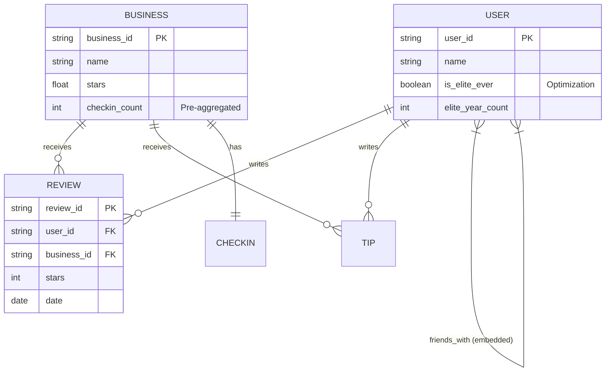
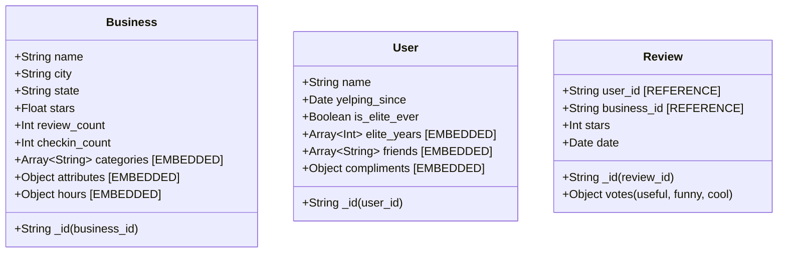
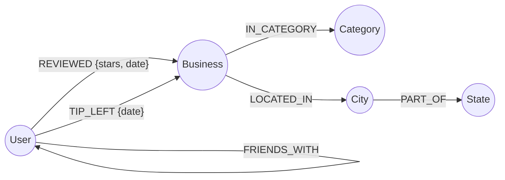

# Database Schema Design & Justifications

This document outlines the architectural decisions for the Polyglot Persistence implementation of the Yelp dataset, utilizing MongoDB (Document Store) and Neo4j (Graph Database).

---

## 1. MongoDB Document Schema Design

### 1.1 Collections and Purpose
The MongoDB database is organized into five collections, optimized for the analytical queries required in Part 1 of the assignment.

1.  **`businesses`**: Stores metadata, location, and operating details. *Optimization*: Includes a pre-calculated `checkin_count` for O(1) correlation analysis.
2.  **`users`**: Stores user profiles and social metrics. *Optimization*: Includes an `is_elite_ever` flag for high-speed filtering of elite status.
3.  **`reviews`**: Stores detailed review text and ratings. *Optimization*: Dates are stored as BSON Date objects for trend analysis.
4.  **`tips`**: Stores short user suggestions.
5.  **`checkins`**: Stores raw check-in timestamps as a reference.

### 1.2 Entity-Relationship (E-R) Diagram
*Logical view of the entities and their relationships.*

### 1.3 Document Schema Diagram
*Physical internal structure of MongoDB documents.*

### 1.4 Justification of Schema Choices

#### A. Embedding Decisions (Categories, Attributes, Friends)
*   **Decision**: Business categories, attributes, and user friend lists are **embedded** as arrays within their respective documents.
*   **Reasoning**: These fields are bounded and frequently accessed alongside the parent entity. Embedding eliminates the need for expensive `$lookup` operations during basic data retrieval.
*   **Trade-offs**: While embedding increases document size, it optimizes **Read** performance. Given that friend lists and categories rarely reach the 16MB BSON limit, the risk of document overflow is negligible.

#### B. Referencing Decisions (Reviews, Tips)
*   **Decision**: Reviews and Tips **reference** `user_id` and `business_id` rather than being embedded.
*   **Reasoning**: This prevents the "Unbound Array" anti-pattern. A business can have thousands of reviews; embedding them would exceed the 16MB limit and cause severe **Write** performance degradation as the document grows and moves on disk.
*   **Trade-offs**: Retrieving a business with all its review text requires a `$lookup`. However, most analytical queries in Part 1 (e.g., city-wide averages) are better served by a flat, indexed `reviews` collection.

#### C. Pre-Aggregation (Check-in Counts)
*   **Decision**: We pre-calculate `checkin_count` during the ETL process and store it in the `Business` document.
*   **Reasoning**: Query 7 requires correlating check-ins with star ratings. Parsing the raw comma-separated check-in string in MongoDB for 150,000 businesses at query-time is computationally expensive. Storing a pre-calculated integer reduces this to a simple numerical comparison.

### 1.5 Identified Indexes (Section 3c)
1.  **Compound Index `{ city: 1, stars: -1 }`**: Optimized for identifying the safest/best-rated cities (Query 1).
2.  **Date Index `{ date: 1 }` on Reviews**: Enables high-speed trend analysis over time (Query 2).
3.  **Filtered Index `{ is_elite_ever: 1 }` on Users**: Allows immediate comparison between elite and non-elite populations (Query 6).
4.  **Reference Index `{ business_id: 1, user_id: 1 }` on Reviews**: Accelerates joins and aggregations across the two main entities.

---

## 2. Neo4j Property Graph Model

### 2.1 Graph Strategy
The graph model is designed to optimize social traversal and geographic aggregations while maintaining a minimal memory footprint for a 16GB RAM environment.

### 2.2 Property Graph Diagram

### 2.3 Justification of Modeling Choices

#### A. Reviews as Relationships (Edges)
*   **Decision**: Reviews are modeled as **Relationships** between a `User` and a `Business` rather than separate nodes.
*   **Reasoning (Memory Optimization)**: On a 16GB RAM machine, storing 7 million reviews as nodes adds significant overhead (node headers and pointers). Modeling them as edges `[REVIEWED]` reduces the graph size by 7 million nodes, keeping the database responsive.
*   **Reasoning (Query Depth)**: Queries like "Users who reviewed businesses in a specific category" are reduced from a 3-hop path to a 2-hop path, significantly improving traversal speed.

#### B. Geographic Hierarchy (City/State Nodes)
*   **Decision**: Cities and States are promoted to **Nodes** instead of remaining as properties on the Business node.
*   **Reasoning**: This enables high-performance geographic filtering. Query 2 ("Top 3 businesses per state") and Query 3 ("Users reviewing across distinct cities") become simple path-counting problems starting from a specific `State` or `City` node, avoiding a full scan of all Business nodes.

#### C. Category Normalization
*   **Decision**: Categories are unique nodes.
*   **Reasoning**: This allows for "Index-free Adjacency." To find all users interested in "Mexican" food, the engine jumps to the "Mexican" node and follows edges back to businesses and users, which is exponentially faster than a string-search across all business properties.