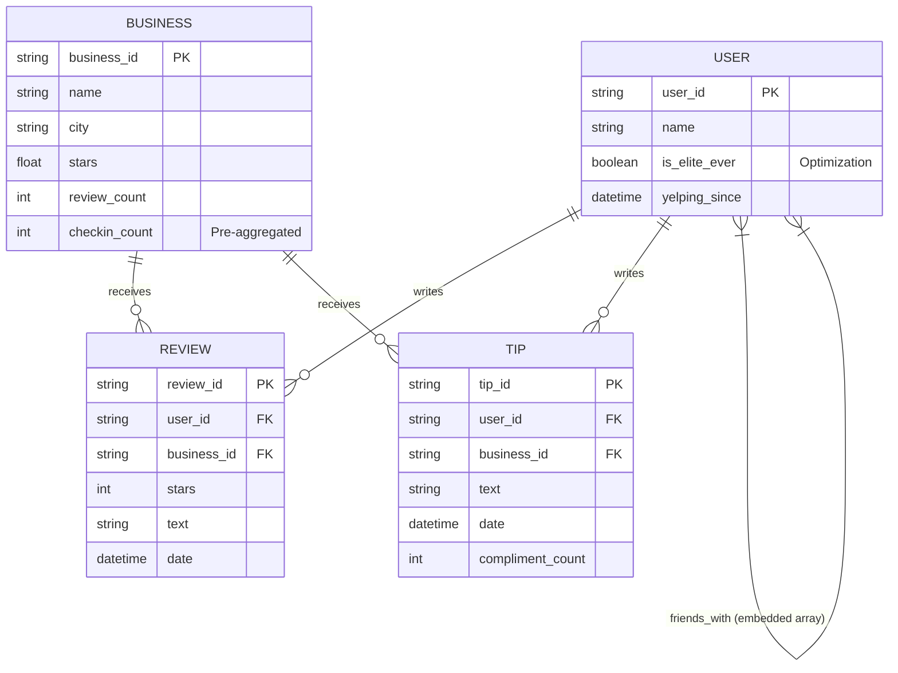
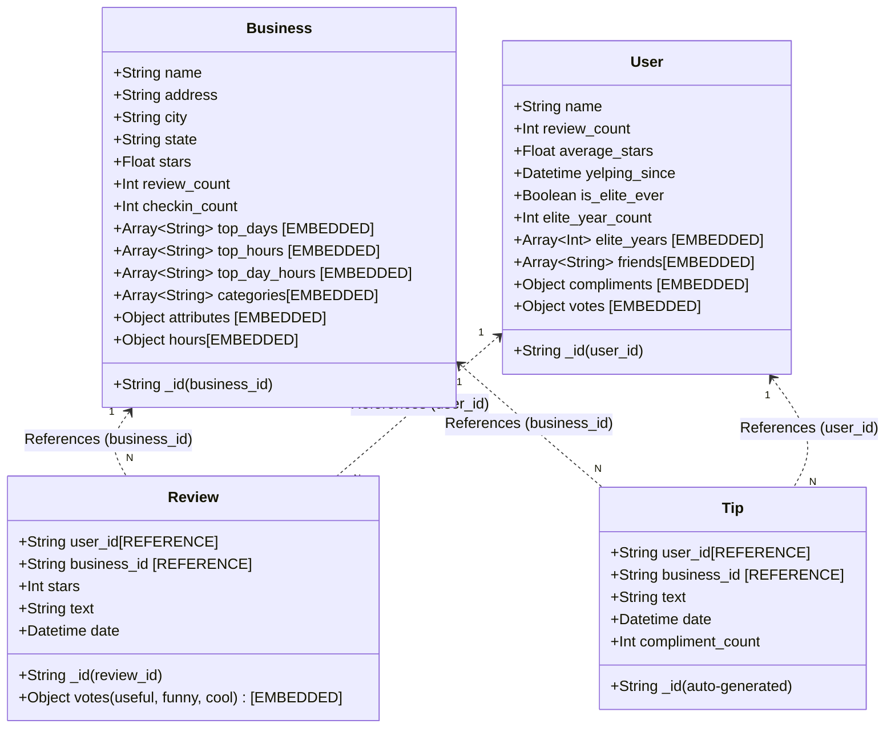
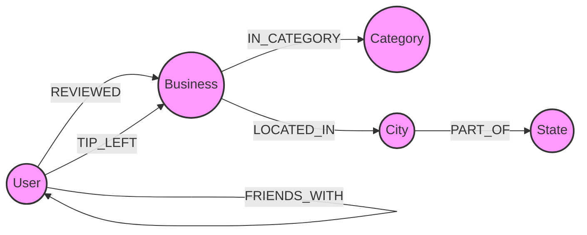

# Database Schema Design & Justifications

This document outlines the architectural decisions for the Polyglot Persistence implementation of the Yelp dataset, utilizing MongoDB (Document Store) and Neo4j (Graph Database).

---

## 1. MongoDB Document Schema Design

### 1.1 Collections and Purpose
The MongoDB database is organized into four distinct collections, heavily optimized for the analytical and temporal queries required in Part 1.

1.  **`businesses`**: Stores metadata, location, and operating details. *Optimization*: Includes advanced pre-calculated check-in statistics (`checkin_count`, `top_days`, `top_hours`, `top_day_hours`) to allow O(1) correlation analysis.
2.  **`users`**: Stores user profiles, compliment metrics, and social network arrays. *Optimization*: Includes an `is_elite_ever` flag for high-speed filtering.
3.  **`reviews`**: Stores detailed review text, votes, and ratings. *Optimization*: Dates are stored as strict `Datetime` objects (preserving time) for granular trend analysis.
4.  **`tips`**: Stores short user suggestions and compliment counts (`Datetime` preserved).
5.  *(Note on Check-ins)*: Raw check-in timestamps are processed during ETL and are **not** loaded as a separate collection. All required temporal analytics have been pre-aggregated into the `businesses` collection.

### 1.2 Entity-Relationship (E-R) Diagram
*Logical view of the entities, their primary keys (PK), foreign keys (FK), and relationships.*

### 1.3 Document Schema Diagram
*Physical internal structure of MongoDB documents, explicitly showing nested objects, arrays, and reference pointers.*

### 1.4 Justification of Schema Choices

#### A. Temporal Pre-Aggregation (Check-in Stats)
*   **Decision**: We parse the raw `checkin.json` during the ETL phase to compute `checkin_count`, `top_days`, `top_hours`, and `top_day_hours`, storing these directly in the `Business` document.
*   **Reasoning**: Query 7 asks for the connection between check-in activity patterns and ratings. Parsing a comma-separated string of thousands of timestamps at query time across 150,000 businesses is an extreme bottleneck. Pre-aggregating these lists allows us to immediately group businesses by their busiest hours (e.g., "Late Night" vs. "Lunch") and correlate them with star ratings using native MongoDB aggregations.

#### B. Referencing Reviews & Tips (vs. Embedding)
*   **Decision**: Reviews and Tips **reference** `user_id` and `business_id` rather than being embedded in the Business or User documents.
*   **Trade-off (Write/Size)**: Embedding reviews inside a business document leads to an unbound array anti-pattern. Highly reviewed businesses (e.g., 10,000+ reviews) would easily exceed MongoDB's 16MB document size limit. Furthermore, continuously appending to an array causes the document to grow, resulting in frequent disk relocations and severe write penalties. Referencing guarantees constant-time $O(1)$ inserts.
*   **Trade-off (Read)**: The read trade-off is that retrieving a business alongside all its review text requires a `$lookup` (join), which is slower than a single localized disk read. However, analytical queries (like average review length per category) aggregate data across the entire dataset rather than pulling a single business, making the flat referenced structure vastly superior for the aggregation pipelines used in this assignment.

#### C. Strict Datetime Casting
*   **Decision**: All `date` fields are strictly cast to BSON Datetime objects during ETL, preserving hours, minutes, and seconds.
*   **Reasoning**: String-based date parsing in MongoDB `$group` stages is slow. Native Datetime objects allow the use of high-performance operators like `$dateTrunc` and `$dateParts` to easily analyze review trends over specific years, months, or times of day (Query 2).

### 1.5 Identified Indexes (Section 3c)
1.  **Compound Index `{ city: 1, stars: -1 }` on Businesses**: Optimized for identifying the safest/best-rated cities (Query 1).
2.  **Datetime Index `{ date: 1 }` on Reviews**: Enables high-speed trend analysis over time (Query 2).
3.  **Filtered Index `{ is_elite_ever: 1 }` on Users**: Allows immediate comparison between elite and non-elite populations (Query 6).
4.  **Reference Index `{ business_id: 1, user_id: 1 }` on Reviews**: Accelerates joins and aggregations across the two main entities.

---

## 2. Neo4j Property Graph Model

### 2.1 Graph Strategy
The graph model is designed to optimize social traversal and geographic aggregations while maintaining a minimal memory footprint for a 16GB RAM environment.

### 2.2 Property Graph Diagram

### 2.3 Node Labels and Properties
*   **`User`**: 
    *   `user_id` (String, Unique Constraint)
    *   `name` (String)
    *   `review_count` (Integer)
    *   `average_stars` (Float)
*   **`Business`**: 
    *   `business_id` (String, Unique Constraint)
    *   `name` (String)
    *   `stars` (Float)
    *   `review_count` (Integer)
*   **`Category`**: 
    *   `name` (String, Unique Constraint)
*   **`City`**: 
    *   `name` (String, Unique Constraint)
*   **`State`**: 
    *   `code` (String, Unique Constraint)

### 2.4 Relationship Types and Properties
*   **`[FRIENDS_WITH]`** (User $\to$ User): 
    *   *No properties*. Represents an undirected social connection.
*   **`[REVIEWED]`** (User $\to$ Business):
    *   `review_id` (String)
    *   `stars` (Integer)
    *   `date` (Datetime)
    *   `useful` (Integer)
*   **`[TIP_LEFT]`** (User $\to$ Business):
    *   `date` (Datetime)
    *   `compliment_count` (Integer)
*   **`[IN_CATEGORY]`** (Business $\to$ Category): 
    *   *No properties*.
*   **`[LOCATED_IN]`** (Business $\to$ City): 
    *   *No properties*.
*   **`[PART_OF]`** (City $\to$ State): 
    *   *No properties*.

### 2.5 Justification of Modeling Choices

#### A. Reviews as Relationships (Edges)
*   **Decision**: Reviews are modeled as **Relationships** (`[REVIEWED]`) between a `User` and a `Business` rather than as separate `Review` nodes.
*   **Reasoning (Memory Optimization)**: On a 16GB RAM machine, storing 7 million reviews as nodes adds massive overhead (node headers and pointers). Modeling them as edges reduces the graph size by 7 million nodes, keeping the database responsive.
*   **Reasoning (Query Depth)**: Queries like "Users who reviewed businesses in a specific category" are reduced from a 3-hop path (`User->Review->Business->Category`) to a 2-hop path (`User->Business->Category`), drastically improving Cypher traversal speed.

#### B. Geographic Hierarchy (City/State Nodes)
*   **Decision**: Cities and States are promoted to **Nodes** instead of remaining as properties on the Business node.
*   **Reasoning**: This enables high-performance geographic filtering. Query 2 ("Top 3 businesses per state") and Query 3 ("Users reviewing across distinct cities") become simple path-counting problems starting from a specific `State` or `City` node, avoiding a full table scan of all Business nodes.

#### C. Category Normalization
*   **Decision**: Categories are extracted into unique nodes.
*   **Reasoning**: This allows for "Index-free Adjacency." To find all users interested in "Mexican" food, the engine jumps to the "Mexican" node and follows edges backwards to businesses and users. This is exponentially faster than executing string-matching operations across a `categories` array property on thousands of Business nodes.